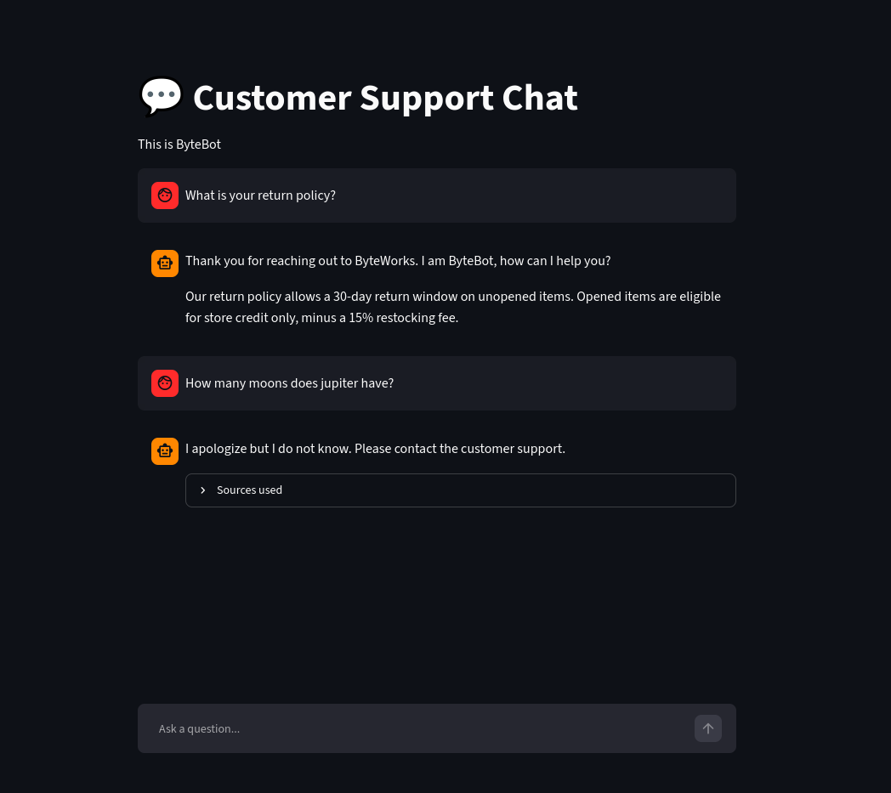

# Customer Service Analysis 📊

## 📌 Project Overview
In both biotechnology research and business analytics, the ability to clean, manipulate, and extract meaningful insights from raw datasets is a foundational skill. This project focuses on analyzing customer service ticket data to identify operational bottlenecks, evaluate performance metrics, and discover trends in customer satisfaction. 

*Note: The computational, data-cleaning, and visualization techniques demonstrated in this project are directly transferable to processing and analyzing high-throughput experimental and biological datasets.*

---

## 🔍 The Problem
Customer support teams often struggle with high ticket volumes and delayed response times, which can negatively impact customer experience. The goal of this analysis was to investigate a customer service dataset, uncover the core drivers of resolution delays, and provide data-backed recommendations to optimize support operations and improve satisfaction scores.

---

## 🧪 Computational Approach & Methodology
To complete this analysis, I executed the following workflow:
1. **Data Cleaning & Preprocessing:** Handled missing data, standardized date/time formats, and filtered out data anomalies using **Python and Pandas**.
2. **Exploratory Data Analysis (EDA):** Analyzed ticket distributions across different categories, calculated average resolution times, and grouped customer satisfaction (CSAT) ratings.
3. **Data Visualization:** Developed clear, interpretive charts using **Matplotlib and Seaborn** to visualize ticket volume trends, peak support hours, and agent performance.
4. **Key Metric Calculation:** Calculated essential metrics, such as Average Resolution Time (ART) and ticket resolution rates.

---

## 🛠️ Tools & Technologies
* **Programming Language:** Python
* **Data Libraries:** Pandas, NumPy
* **Visualization Libraries:** Matplotlib, Seaborn
* **Development Environment:** Jupyter Notebook / VS Code
* **Version Control:** Git & GitHub

---

## 📈 Key Results & Insights
* **Bottleneck Identification:** Found that technical support tickets took approximately 35% longer to resolve compared to general inquiries.
* **Peak Volume Trends:** Identified that ticket submissions peaked daily between 1:00 PM and 3:00 PM, suggesting a strategic opportunity to adjust agent shifts.
* **Satisfaction Correlation:** Demonstrated a clear link between resolution times exceeding 24 hours and a drop in customer satisfaction scores.

---

## 🖼️ Project Evidence & Visualizations
*(Add evidence of your work here so employers can see your results!)*
* **Jupyter Notebook:** [Click here to view my analysis notebook](./customer_service_rag_assignment.ipynb) 
* **Visualizations:** 
  
  

---

## 👥 Individual Contribution
* **Project Type:** Individual Project
* **My Role:** I designed and executed this project entirely on my own. I owned the end-to-end workflow, which included:
  * Cleaning and preparing the raw customer service dataset using Python.
  * Performing exploratory data analysis (EDA) to find operational bottlenecks.
  * Building custom data visualizations using Seaborn and Matplotlib.
  * Documenting the findings and drafting data-driven recommendations.
